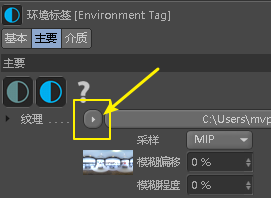
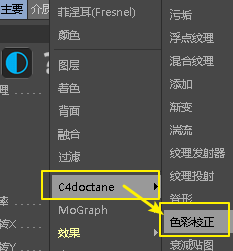
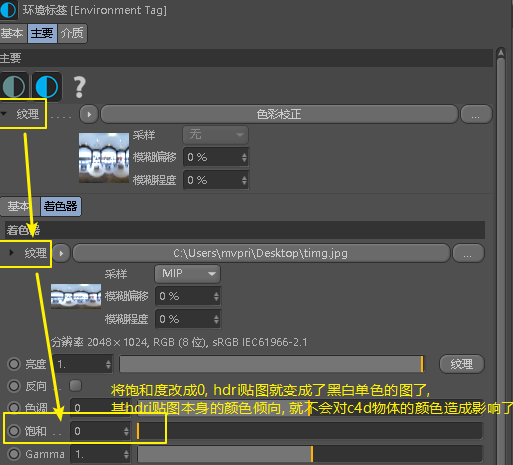
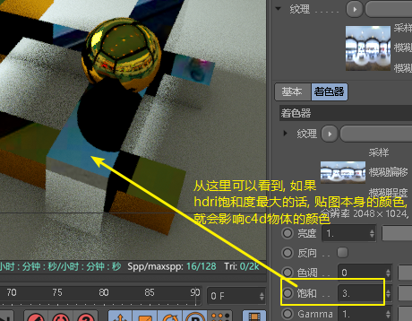
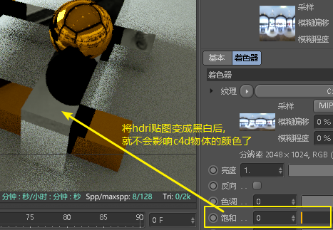
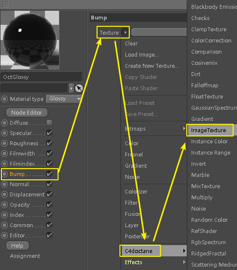
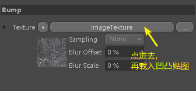
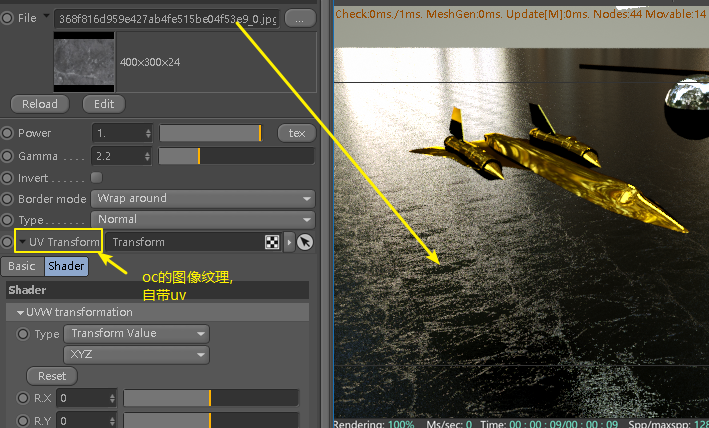

= 01. oc 金属效果
:toc:

---

== 金属效果

index层的值, 设成1, 则就是镜面全反射. +
如果要白色金属, 则在specular层中, 将颜色改成白色即可.

---

如果整体画面太暗, 则可以添加一个 oc的 texture environment

---

== hdri 环境贴图

我们为了让金属物体能反射出环境光, 可以添加hdri环境

如果我们不想将hdri贴图作为背景显示在场景中, 只想让3d物体表面反射hdri贴图, 就将type改成 visible environment. +
并将其的子值只打开 reflections.

注意, 为了让3d物体的镜面材质, 能很明显的反射出hdri贴图, 必须将镜面材质的粗糙度(roughness), 降低或关闭.

---

如果你觉得hdri贴图的颜色太亮或太暗, 还可以设置hdri贴图的曝光度

---

另一种方法是: 在环境贴图设置中, 点这个三角

---

== 凹凸贴图

我们来用凹凸贴图(假凹凸), 来赋给地面 +
1. 先创建一个 glossy材质, 赋给地面 +
2. 再关掉diffuse层, bump层中, 添加一个oc的ImageTexture, 它有一个好处, 自带uv.

