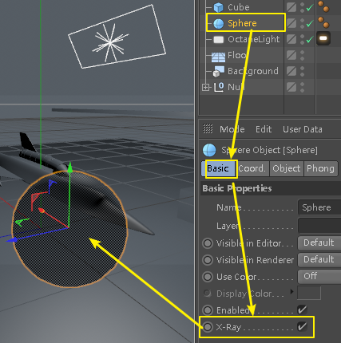
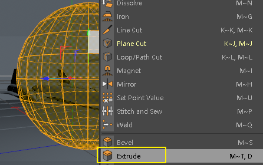
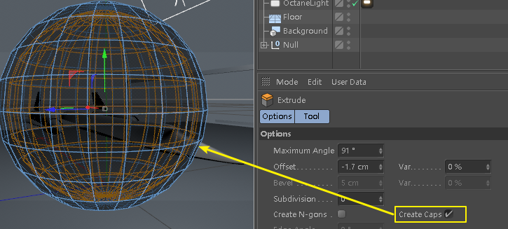
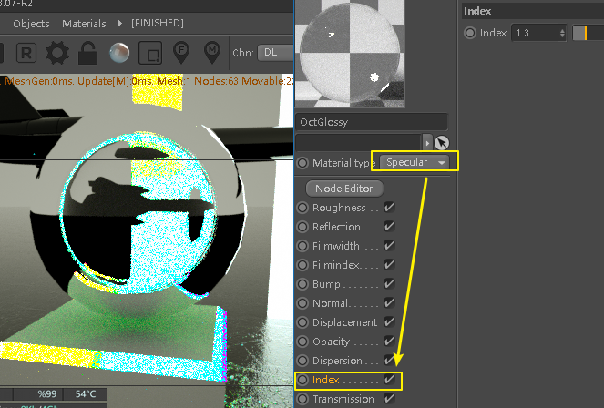
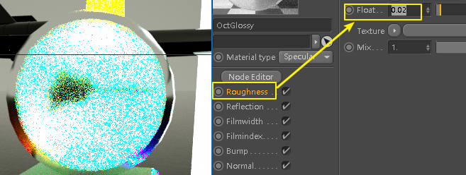
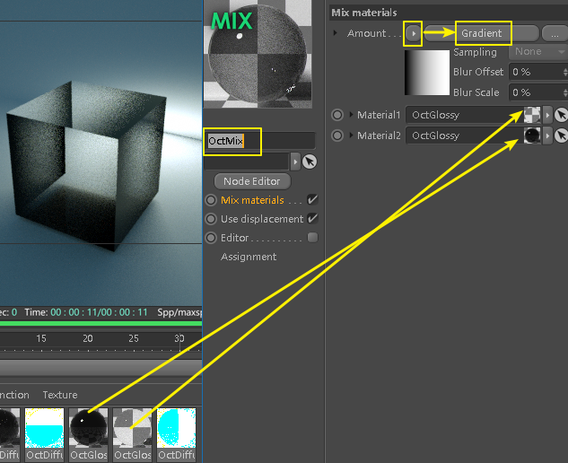
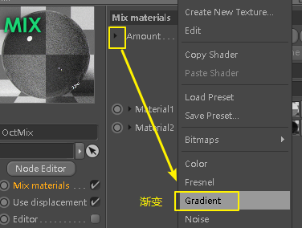
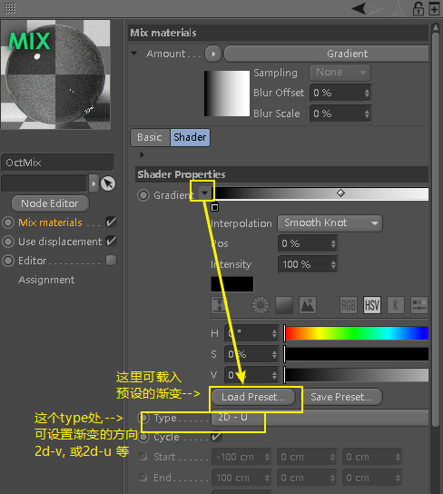

= oc 玻璃效果
:toc:

---

== 半透明显示物体

让物体在软件中显示半透明效果(非渲染), 只要打开它的 x-ray就行了

---

== 给球面加厚度

选中球体, c掉,  +
进入面编辑模式, 选中一个面, ctrl+a 全选,  +
右键, 选挤压 extrude, +
在右边的挤压选项中, 选中"创建封顶" create caps, +
按住鼠标左键拖动, 就能挤出一个厚度

---

== oc 玻璃效果

玻璃效果, 要用 oc 的 specular材质. 其index层的值越大, 则玻璃越不透明(效果就好像玻璃的厚度越大一样)

roughness层, 可设置毛玻璃效果

---

== oc 混合材质

将两种材质, 拖到oc混合材质中 +
给它一个渐变, 则两种材质, 会按渐变的黑白色区域, 来分别显示某一种材质

