= oc 自发光效果
:toc:

---

== 1. 单色自发光

oc 的自发光分两种 : 单色自发光, 和渐变色自发光

单色自发光, 选"黑体发光" blackbody emission

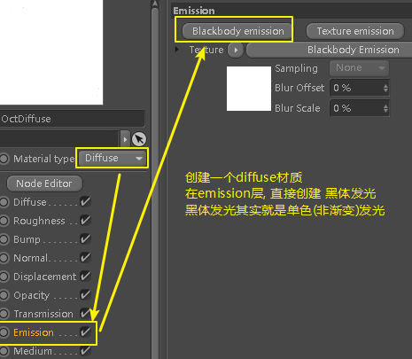

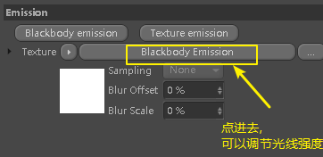

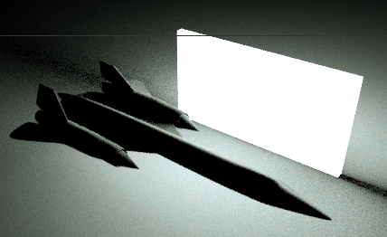

默认自发光,是白色, 要改变灯光颜色, 就给它添加一个oc的 rgbSpectrum纹理, 改变颜色

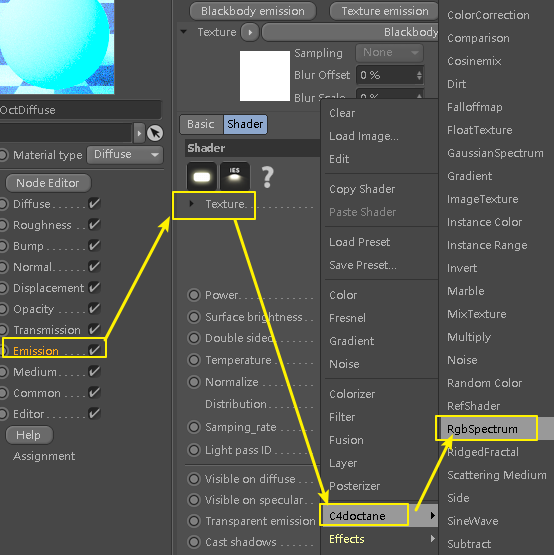

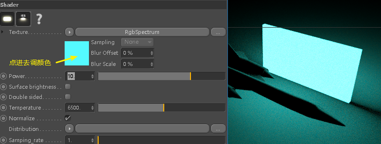

注意! 自发光的颜色, 是在 emission层中来修改, 而不是在 diffuse层中修改!

---

== 让镜面物体, 不反射出自发光物体的形象

默认情况下, 镜面物体(比如本飞机), 会反射出自发光物体本身.

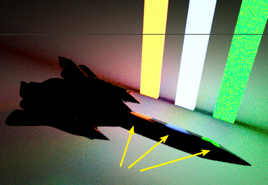

如果你不想镜面物体反射出某自发光物体, 可以在黑体发光的设置中, 关掉 visible on specular . 如下效果

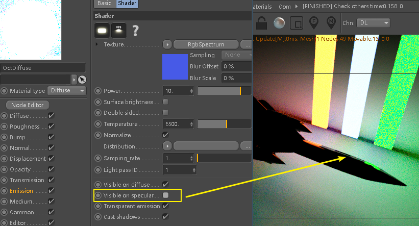

还可以关掉 Visible on diffuse（漫射可见）：灯光的照明是否计算漫反射.

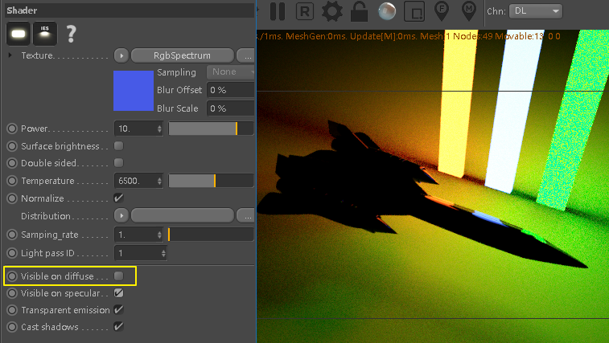

---

== 辉光

在oc设置的 post 中, 打开 enable, 可以设置辉光效果

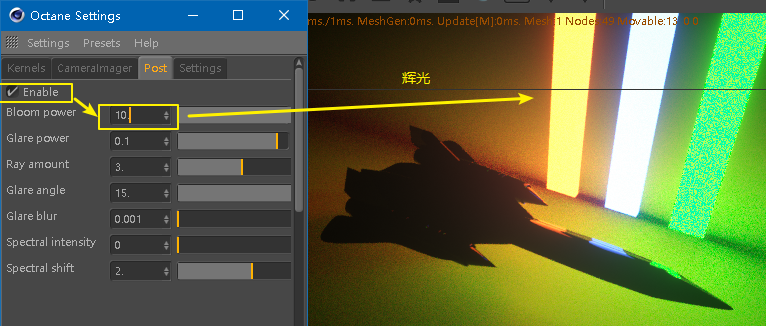

此处还可以设置炫光

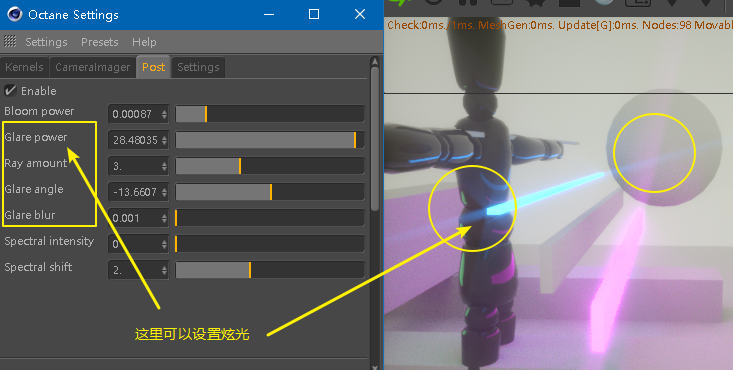

---

== 2. 渐变自发光

如果想要渐变自发光效果, 就要用"纹理发光"

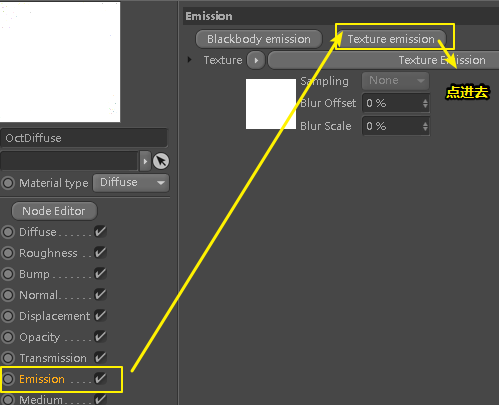

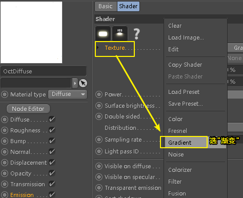

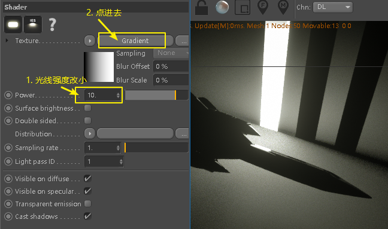

还可以加载oc自带的渐变预设. +
type属性中的 2d-u, 是垂直渐变; 2d-v, 是水平渐变

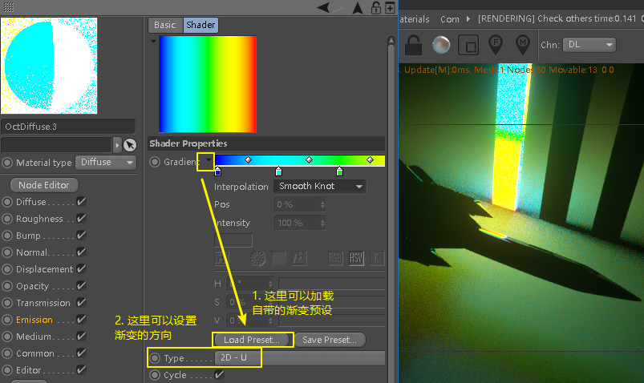

---

== 将"渐变自发光", 完全拉伸到3d物体的宽高范围

点击自发光材质标签, 将projection的值改成 flat

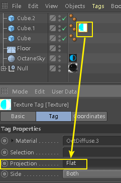

然后右键自发光材质标签, 选 fit to object, 就能将"渐变自发光", 完全拉伸到3d物体的宽高范围.

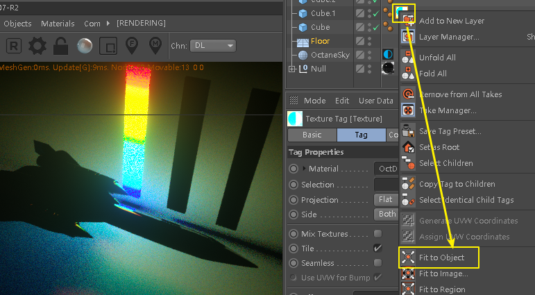

