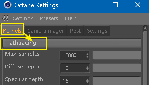
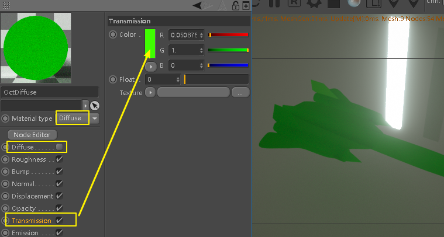
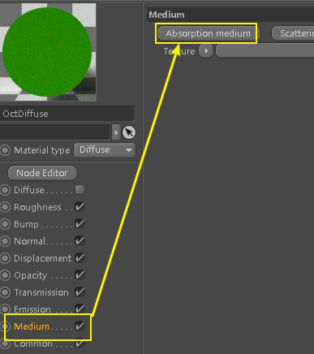
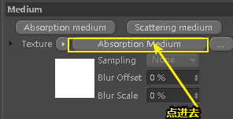
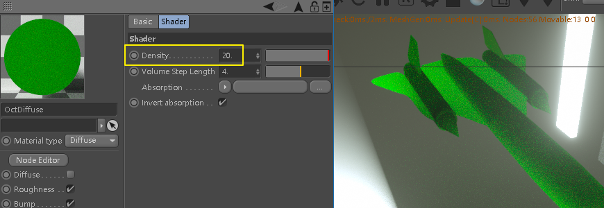
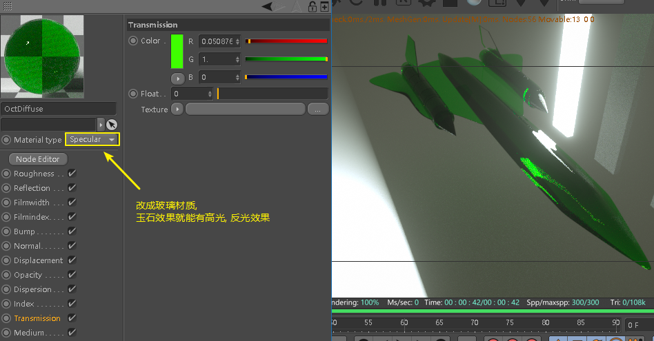

= oc 玉石效果 / SSS材质
:toc:

---

== 玉石效果

要想得到玉石效果, 首先必须在oc设置中, 将渲染模式改成"光线跟踪".

使用 diffuse材质球, 关掉 diffuse层, 在 transmission层中, 设置玉石颜色

然后在medium层中, 点击吸收介质 absorption medium

默认的密度是100, 表示光线无法穿透物体. 我们要把它改小, 即允许光线慢慢渗透进去, 才会有玉石效果.

但用这种方式创建的玉石效果, 会发现物体身上无反射, 无高光. 为了让它有反射, 我们只需把oc材质切换成玻璃即可.

